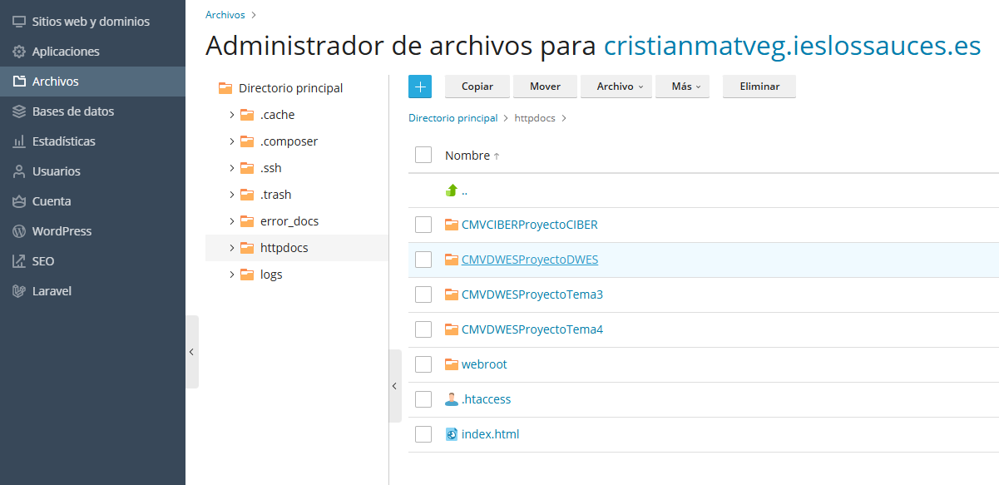
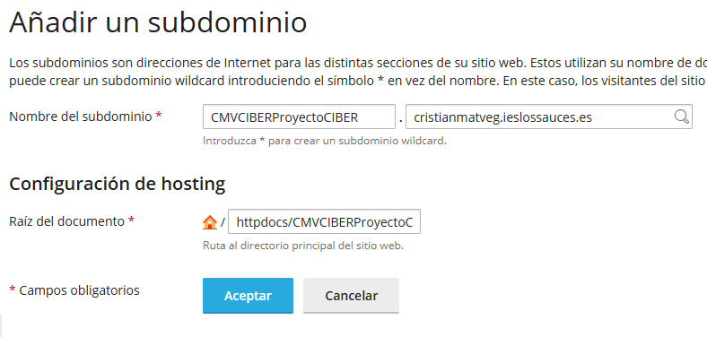

# CFGS Desarrollo de Aplicaciones Web

|  CFGS DESARROLLO  DE APLICACIONES WEB |
|:-----------:|
||
| DESPLIEGUE DE APLICACIONES WEB
| CIBERSEGURIDAD
| DWES Tema 2. INSTALACIÓN, CONFIGURACIÓN Y DOCUMENTACIÓN DE ENTORNO DE DESARROLLO Y DEL ENTORNO DE EXPLOTACIÓN |

- [CFGS Desarrollo de Aplicaciones Web](#cfgs-desarrollo-de-aplicaciones-web)
  - [3.Entorno de Explotación](#3entorno-de-explotación)
      - [Gestión de archivos en EE](#gestión-de-archivos-en-ee)
      - [Creación de subdominios](#creación-de-subdominios)

## 3.Entorno de Explotación
#### Gestión de archivos en EE
En el apartado Archivos podremos gestional los archivos de nuestra página

#### Creación de subdominios
Ir a "Añadir subdominio"

\
Configurar el nombre de nuestro subdominio y la ubicacion de los archivos

---

> **Cristian Mateos Vega**  
> Curso: 2025/2026  
> 2º Curso CFGS Desarrollo de Aplicaciones Web  