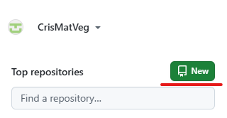
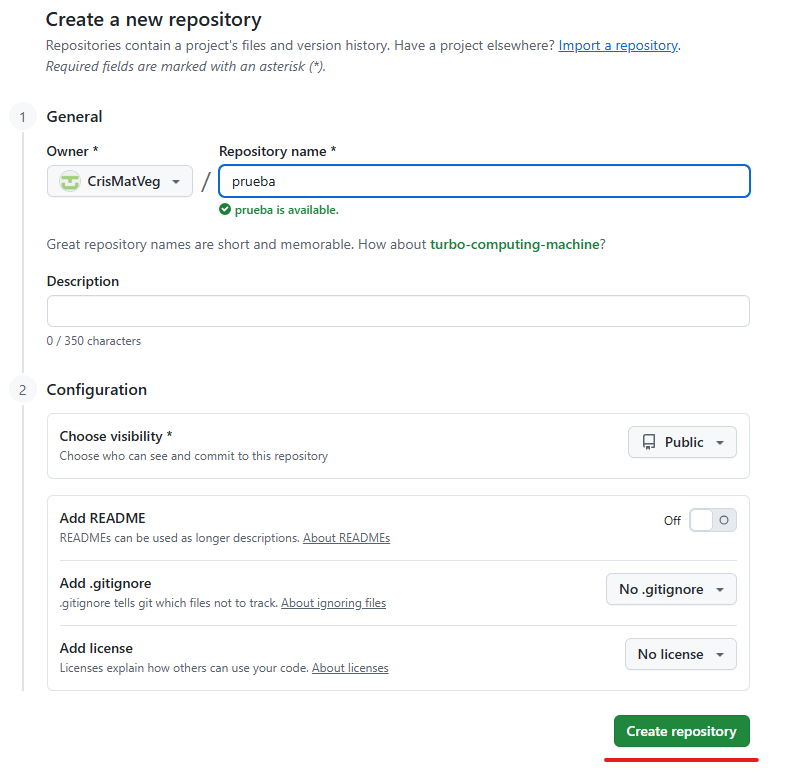

# CFGS Desarrollo de Aplicaciones Web

|  CFGS DESARROLLO  DE APLICACIONES WEB |
|:-----------:|
||
| DESPLIEGUE DE APLICACIONES WEB
| CIBERSEGURIDAD
| DWES Tema 2. INSTALACIÓN, CONFIGURACIÓN Y DOCUMENTACIÓN DE ENTORNO DE DESARROLLO Y DEL ENTORNO DE EXPLOTACIÓN |

- [CFGS Desarrollo de Aplicaciones Web](#cfgs-desarrollo-de-aplicaciones-web)
  - [2. GitHub](#2-github)
    - [Requisitos previos](#requisitos-previos)
    - [Crear un repositorio en GitHub](#crear-un-repositorio-en-github)
    - [Clonar un repositorio en tu máquina local](#clonar-un-repositorio-en-tu-máquina-local)
    - [Añadir archivos y hacer commits](#añadir-archivos-y-hacer-commits)
    - [Enviar cambios al repositorio remoto (push)](#enviar-cambios-al-repositorio-remoto-push)
    - [Obtener cambios del repositorio remoto (pull)](#obtener-cambios-del-repositorio-remoto-pull)
    - [Otras funciones](#otras-funciones)
      - [Ver el estado de los archivos:](#ver-el-estado-de-los-archivos)
      - [Ver historial de commits:](#ver-historial-de-commits)
      - [Crear una nueva rama:](#crear-una-nueva-rama)
      - [Cambiar de rama:](#cambiar-de-rama)


## 2. GitHub
### Requisitos previos
1. Tener una cuenta en [GitHub](https://github.com/)
2. Instalar [Git](https://git-scm.com/) en tu sistema
3. Configurar Git con tus credenciales:
```bash
git config --global user.name "Tu Nombre"
git config --global user.email "tuemail@example.com"
```
### Crear un repositorio en GitHub
1. Inicia sesión en GitHub
2. Haz clic en el botón New (nuevo repositorio)\

3. Asigna un nombre al repositorio
4. Opcional: añade una descripción, README, .gitignore y licencia
5. Haz clic en Create repository\


### Clonar un repositorio en tu máquina local
```bash
# Esto crea una copia local del repositorio remoto.
git clone https://github.com/usuario/repositorio
```

### Añadir archivos y hacer commits
1. Añade o modifica archivos en tu carpeta local
2. Añade los archivos al área de preparación:

```bash
git add archivo.txt
# o para todos los archivos
git add .
# Realiza un commit con un mensaje descriptivo:
git commit -m "Descripción del cambio"
```

### Enviar cambios al repositorio remoto (push)
```bash
# Reemplaza main por la rama que estés usando si es diferente.
git push origin main
```

### Obtener cambios del repositorio remoto (pull)
```bash
# Esto sincroniza tu copia local con los cambios del repositorio remoto.
git pull origin main
```

### Otras funciones
#### Ver el estado de los archivos:
```bash
git status
```
#### Ver historial de commits:
```bash
git log
```
#### Crear una nueva rama:
```bash
git checkout -b nombre-rama
```
#### Cambiar de rama:
```bash
git checkout nombre-rama
```
---

> **Cristian Mateos Vega**  
> Curso: 2025/2026  
> 2º Curso CFGS Desarrollo de Aplicaciones Web  