# CFGS Desarrollo de Aplicaciones Web

|  CFGS DESARROLLO  DE APLICACIONES WEB |
|:-----------:|
||
| DESPLIEGUE DE APLICACIONES WEB
| CIBERSEGURIDAD
| DWES Tema 2. INSTALACIÓN, CONFIGURACIÓN Y DOCUMENTACIÓN DE ENTORNO DE DESARROLLO Y DEL ENTORNO DE EXPLOTACIÓN |


- [CFGS Desarrollo de Aplicaciones Web](#cfgs-desarrollo-de-aplicaciones-web)
  - [1. Entorno de Desarrollo](#1-entorno-de-desarrollo)
    - [1.1 Ubuntu Server 24.04.3 LTS](#11-ubuntu-server-24043-lts)
      - [1.1.1 **Configuración inicial**](#111-configuración-inicial)
        - [Nombre y configuraicón de red](#nombre-y-configuraicón-de-red)
        - [**Actualizar el sistema**](#actualizar-el-sistema)
        - [**Configuración fecha y hora**](#configuración-fecha-y-hora)
        - [**Cuentas administradoras**](#cuentas-administradoras)
        - [**Habilitar cortafuegos**](#habilitar-cortafuegos)
          - [Monitorizacion](#monitorizacion)
          - [Mantenimiento](#mantenimiento)
      - [1.1.2 Instalación del servidor web Apache HTTP](#112-instalación-del-servidor-web-apache-http)
        - [Instalación](#instalación)
        - [Verficación del servicio](#verficación-del-servicio)
        - [Virtual Hosts](#virtual-hosts)
        - [Permisos y usuarios](#permisos-y-usuarios)
        - [Ficheros .log de Apache](#ficheros-log-de-apache)
      - [1.1.3 PHP](#113-php)
        - [Proceso para instalar y configurar PHP 8.3 como servicio FPM (FastCGI Process Manager) en un servidor Apache sobre Ubuntu](#proceso-para-instalar-y-configurar-php-83-como-servicio-fpm-fastcgi-process-manager-en-un-servidor-apache-sobre-ubuntu)
        - [Módulo php8.3-intl](#módulo-php83-intl)
        - [Ficheros .log de PHP](#ficheros-log-de-php)
      - [1.1.4 MariaDB](#114-mariadb)
      - [1.1.5 XDebug](#115-xdebug)
      - [1.1.6 Servidor web seguro Apache HTTPS](#116-servidor-web-seguro-apache-https)
        - [ErrorDocument](#errordocument)
        - [Redirección HTTP a HTTPS](#redirección-http-a-https)
        - [Enjaular Usuarios](#enjaular-usuarios)
      - [1.1.7 DNS](#117-dns)
      - [1.1.8 SFTP](#118-sftp)
      - [1.1.9 Apache Tomcat](#119-apache-tomcat)
      - [1.1.10 LDAP](#1110-ldap)
      - [1.2.2 **Navegadores**](#122-navegadores)
      - [1.2.3 **MobaXTerm**](#123-mobaxterm)
      - [1.2.4 **Netbeans**](#124-netbeans)
        - [**Crear Proyecto**](#crear-proyecto)
        - [**Eliminar Proyecto**](#eliminar-proyecto)
        - [**Control de versiones**](#control-de-versiones)
        - [**Debug**](#debug)
        - [**Conexión con bases de datos**](#conexión-con-bases-de-datos)
      - [1.2.5 **Visual Studio Code**](#125-visual-studio-code)

## 1. Entorno de Desarrollo

### 1.1 Ubuntu Server 24.04.3 LTS

Este documento es una guía detallada del proceso de instalación y configuración de un servidor de aplicaciones en Ubuntu Server utilizando Apache, con soporte PHP y MySQL

```bash
#Para ver version del sistema:
uname -a
```

#### 1.1.1 **Configuración inicial**

##### Nombre y configuraicón de red

> **Nombre de la máquina**: CMV-USLimpia\
```bash
#Se ve con: 
hostname

#Se cambia con:
1. sudo hostnamectl set-hostname "nombre"
2. sudo nano /etc/hosts y cambiando la linea donde pone 127.0.1.1
```
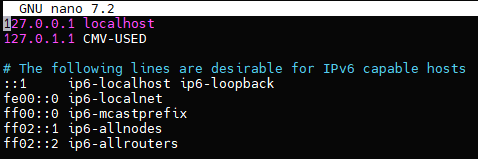

> **Memoria RAM**: 2G\
> **Particiones**: 150G(/) y resto (/var)\
```bash
#Se ve con:
df -h
```
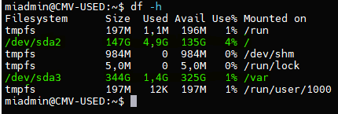
> **Configuración de red interface**: enp0s3\
> **Dirección IP** :10.199.8.248/22\
> **GW**: 10.199.8.1/22\
> **DNS**: 10.151.123.21 y 10.151.126.21
```bash
#Se ve con:
ip a (RED)
ip r (GW)
resolvectl (DNS)

#Se cambia entrando en:
sudo nano /etc/netplan/enp0s3.yaml
(Ver más abajo)
```

Editar el fichero de configuración del interface de red  **/etc/netplan**,
```bash
#CONFIGURACION DINAMICA
network:
  version: 2
  ethernets:
    enp0s3:
      dhcp4: true
````

```bash
#CONFIGURACION ESTATICA
network:
  ethernets:
    enp0s3:
      addresses:
       - 10.199.8.248/22
      nameservers:
         addresses:
         - 10.151.123.21
         - 10.151.126.21
         search: [educa.jcyl.es]
      routes:
        - to: default
          via: 10.199.8.1
  version: 2
````

##### **Actualizar el sistema**

```bash
sudo apt update
sudo apt upgrade
```

##### **Configuración fecha y hora**

[Establecer fecha, hora y zona horaria](https://somebooks.es/establecer-la-fecha-hora-y-zona-horaria-en-la-terminal-de-ubuntu-20-04-lts/ "Cambiar fecha y hora")


##### **Cuentas administradoras**

> - [X] root(inicio)
> - [X] miadmin/paso
> - [X] miadmin2/paso

```bash
#Los usuarios se ven en:
sudo cat /etc/passwd [|grep "nombre de usuario para filtrar"]

#Para ver los usuarios por grupo:
sudo cat /etc/group
```
##### **Habilitar cortafuegos**
```bash
#Para encender cortafuegos:
sudo ufw start

#Para habilitar puertos:
sudo ufw allow 22

#Para ver estado y puertos activos:
sudo ufw status [numbered]

#Para eliminar algún puerto
sudo ufw delete "nº de puerto (ver con numbered)"
``` 
###### Monitorizacion
```bash
sudo ufw status verbose    # Mostramos el estado detallado del cortafuegos y las reglas activas
```
###### Mantenimiento
```bash
# Desactivamos el cortafuegos temporalmente
sudo ufw disable
# Reseteamos todas las reglas a la configuración inicial           
sudo ufw reset             
```
#### 1.1.2 Instalación del servidor web Apache HTTP

##### Instalación
```bash
sudo apt install apache2
sudo ufw allow 80
```
##### Verficación del servicio
```bash
sudo service apache2 status
sudo systemctl status apache2
```
##### Virtual Hosts
1. Añadir registro DNS
En Plesk vamos a la ventana de Hosting y DNS y le damos a DNS
Ahí dentro le damos a Añadir registro\
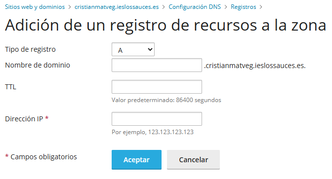
- En tipo de registro ponemos A
- Ponemos un nombre de dominio
- El TTL lo dejamos como está
- Dirección IP ponemos el de nuestro servidor Apache
- Luego tendremos que darle a actualizar y ya estaría
2. Comprobar usuario enjaulado SFTP\
El sitio creado anteriormente va a ser de un usuario enjaulado (ver en el apartado de Enjaulado de usuarios)
3. Crear nuevo sitio.conf\
Copiamos el archivo de configuracion del sitio por defecto en un nuevo archivo ``nuevo-sitio``.conf y dentro lo tenemos que dejar así:\
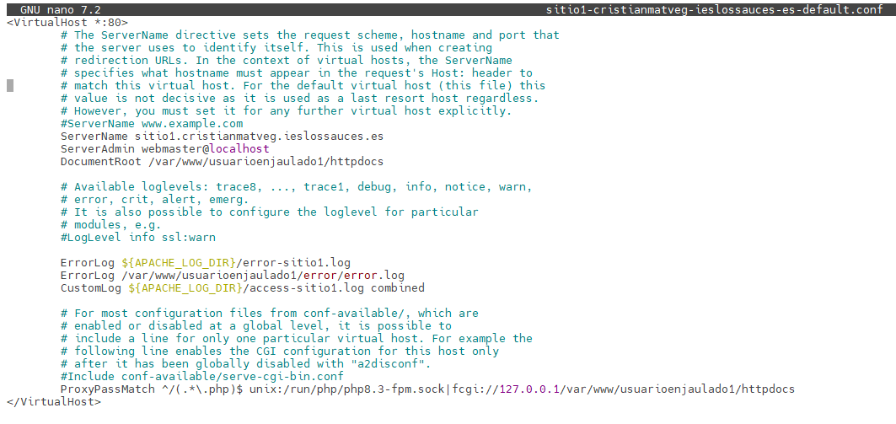
Ahora metemos los archivos de nuestro sitio en httpdocs en la ruta indicada conectandonos con el usuarioenjaulado1 por sftp
- Si utiliza base de datos y tenemos los respectivos scripts de esa base de datos para crearla y darle carga inicial los ejecutamos con ``sudo mariadb -u adminsql -p < script.sql``\
Ahora si entramos en http://(ServerName del nuevo sitio) tiene que salirnos el index que subimos antes a httpdocs
4. phpmyadmin\
**NO FUNCIONA**

##### Permisos y usuarios
```bash
#Para crear el usuario y asignarle una contraseña
sudo useradd -M -d /var/www/html -s /bin/bash -g www-data operadorweb
sudo passwd operadorweb

#Para comprobar que se ha creado bien:
cat /etc/passwd | grep operadorweb

#Cambiar propietario de grupo:
sudo chown -R operadorweb:www-data /var/www/html

#Cambiar permisos de la carpeta:
sudo chmod -R 775 /var/www/html
```
Los archivos de configuracion de Apache se encuentran en **``/etc/apache2/``**:
  - **``apache2.conf``**: es el archivo de configuracion inicial. Es el primer fichero que se ejecuta cuando arrancamos el servidor.
  - **``ports.conf``**: donde se definen los puertos en los que Apache escuchará las conexiones
  - **``mods-available/``**: Contiene todos los módulos de Apache que están instalados en el sistema.
  - **``mods-enabled/``**: Contiene enlaces simbólicos a los módulos de mods-available/ que están activos, es decir, cargados y funcionando en el servidor.
  - **``conf-available/``**: Almacena archivos de configuración global mediante enlaces simbólicos influyendo en la configuración general del servidor.
  - **``conf-enabled/``**: Contiene enlaces simbólicos a los archivos de conf-available/ que están activos, aplicando su configuración al servidor.
  - **``sites-available/``**: Guarda archivos de configuración de sitios virtuales mediante enlaces simbólicos, permitiendo configurar diferentes sitios alojados en el mismo servidor
  - **``sites-enabled/``**: Contiene enlaces simbólicos a los archivos de sites-available/ que están activos, habilitando los sitios virtuales correspondientes.

##### Ficheros .log de Apache

#### 1.1.3 PHP
##### Proceso para instalar y configurar PHP 8.3 como servicio FPM (FastCGI Process Manager) en un servidor Apache sobre Ubuntu
```bash
#Instala herramientas para administrar los repositorios de software, como add-apt-repository
sudo apt install software-properties-common -y
 
#Añade un repositorio que proporciona versiones actualizadas de PHP (incluyendo 8.3).
sudo add-apt-repository ppa:ondrej/php -y

#Muestra los archivos de configuración de los repositorios y filtra los que contienen "ondrej". Sirve como verificación de que el repositorio se agregó correctamente
ls /etc/apt/sources.list.d/ | grep ondrej
 
#Actualiza la base de datos local de paquetes con la nueva información del repositorio ondrej/php.
sudo apt update
 
#Instala: 
#libapache2-mod-php8.3: módulo clásico de PHP para Apache. (OPCIONAL, mejor no instalarlo para evitar conflictos)
#php8.3-fpm: versión de PHP como servicio FPM (mejor para rendimiento y aislamiento).
sudo apt install libapache2-mod-php8.3 php8.3-fpm -y
 
#Desactiva mod_php, el método tradicional en que Apache ejecuta PHP. Esto es necesario para evitar conflictos con FPM.
sudo a2dismod php8.3
 
#mpm_prefork es el módulo de procesamiento que se usa con mod_php. Incompatible con proxy_fcgi, por eso se desactiva.
sudo a2dismod mpm_prefork
 
#mpm_event: MPM más moderno y eficiente, compatible con php-fpm. proxy_fcgi: Asegura que Apache pueda comunicarse con PHP-FPM.
sudo a2enmod mpm_event proxy_fcgi
 
#Activa el archivo de configuración que conecta Apache con el servicio php8.3-fpm.
sudo a2enconf php8.3-fpm
 
#Reinicia Apache para que los cambios surtan efecto.
sudo systemctl restart apache2
```
En **/etc/php/8.3/apache2/php.ini** y **/etc/php/8.3/fpm/php.ini**

- Cambiar **display_errors** a "On"
- Cambiar **display_startup_errors** a "On"

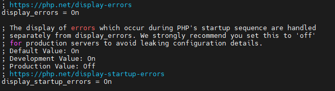
- Cambiar **memory_limit** a "256M"

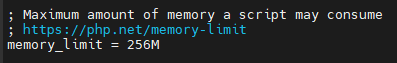

##### Módulo php8.3-intl
Permite que PHP muestre información adaptada a la región e idioma, sin que tengas que hacerlo manualmente.
```bash
#Instalar
sudo apt install php8.3-intl
sudo systemctl restart php-fpm
```
En **/etc/php/8.3/apache2/php.ini** y **/etc/php/8.3/fpm/php.ini**

- Cambiar **date.timezone** a "Europe/Madrid"

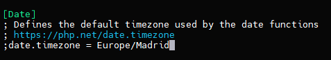
##### Ficheros .log de PHP

#### 1.1.4 MariaDB
```bash
#Instalar MariaDB
sudo apt udpate
sudo apt install mariadb-server -y

#Cambiar en el fichero indicado la linea bind-address = 127.0.0.1 (lo cambiamos a 0.0.0.0)
sudo nano /etc/mysql/mariadb.conf.d/50-server.cnf
```
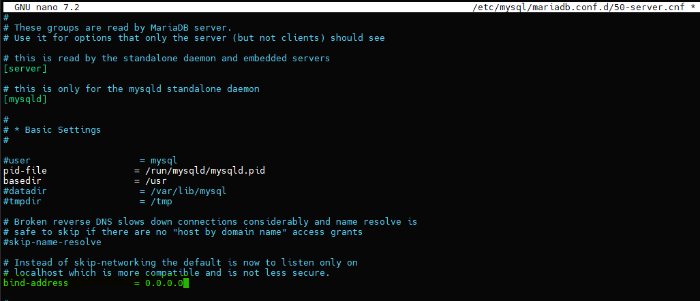
```bash
#Reiniciamos el servicio
sudo systemctl restart mariadb

#Comprobamos puerto usado por MariaDB (usará el 3306 por defecto)
sudo ss -punta |grep mariadb

#Lo habilitamos
sudo ufw allow 3306

#Entramos en la consola de MariaDB
sudo mariadb

#Creamos un nuevo usuario
CREATE USER 'adminsql'@'%' IDENTIFIED BY 'paso'
GRANT ALL ON *.* TO 'adminsql'@'%' WITH GRANT OPTION;

#Listar todos los usuarios y desde que host pueden conectarse
SELECT User, Host FROM mysql.user;

#Asegurar MariaDB ejecutando un sript de seguridad
sudo mysql_secure_installation

- En el primer paso preguntará por la contraseña de root para MariaDB, pulsa la tecla Enter ya que no hay contraseña definida.
- La siguiente, preguntará si quieres asignar una contraseña para el usuario “root”, le damos que si y le ponemos una.
- En el tercer paso preguntará si quieres eliminar usuario anónimo, aquí indica que Sí quieres borrar los datos.
- Después preguntará si quieres desactivar el acceso remoto del usuario “root”, aquí indica que Sí quieres desactivar acceso remoto para usuario por seguridad.
- De nuevo preguntará si quieres eliminar la base de datos test, aquí indica de nuevo que Sí quieres borrar las base de datos de prueba.
- Por último, preguntará si quieres recargar privilegios, aquí indica que Sí.
```
#### 1.1.5 XDebug
```bash
#Instalar
sudo apt install php8.3-xdebug

#Entrar en /etc/php/8.3/fpm/conf.d/20-xdebug.ini y añadir
xdebug.mode=develop,debug
xdebug.start_with_request=yes
xdebug.client_host=127.0.0.1
xdebug.client_port=9003
xdebug.log=/tmp/xdebug.log
xdebug.log_level=7
xdebug.idekey="netbeans-xdebug"
xdebug.discover_client_host=1

#Reiniciar servidor
sudo systemctl restart php8.3-fpm
```

#### 1.1.6 Servidor web seguro Apache HTTPS
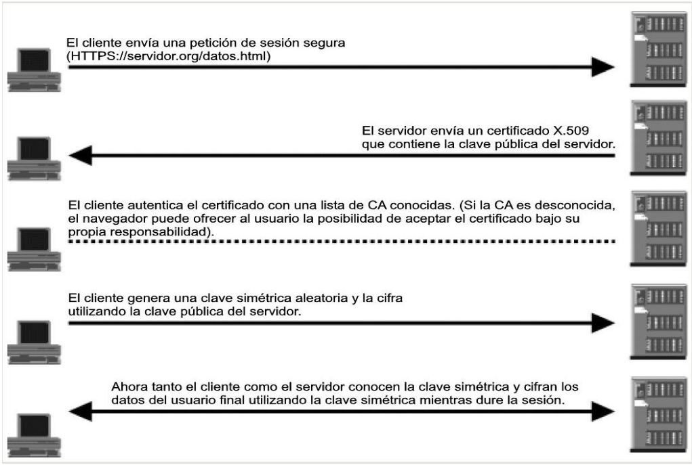
```bash
#Para crear certificado digital:
sudo openssl req -x509 -nodes -days 365 -newkey rsa:2048 -keyout /etc/ssl/private/"nombre".key -out /etc/ssl/certs/"nombre".crt

luego nos pedirá varios datos, los ponemos y ya estaría creado
#Comprobar certificados en:
sudo ls /etc/ssl/private |grep "nombre"
sudo ls /etc/ssl/certs |grep "nombre"

#Habilitar módulo ssl
sudo a2enmod ssl

#Crear (o copiar) configuración del sitio seguro
sudo cp default-sss.conf "nombre".conf

#Cambiar rutas al certificado dentro de "nombre".conf donde he marcado en verde
```
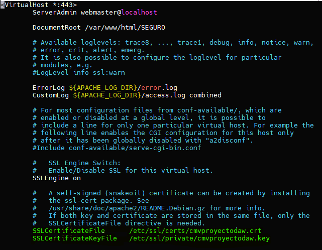
```bash
#Activar puerto 443
sudo ufw allow 443

#Activar sitio seguro
sudo a2ensite "nombre".conf

#Reiniciar servidor apache
sudo systemctl restart apache2
```
##### ErrorDocument
```bash
# Para cada error tendremos que poner la siguiente linea en el .htaccess de nuestra página, que se encuentra en /var/www/html
ErrorDocument "Codigo de Error" /error/"archivo para ese error".html
# El directorio error ha sido creado previamente para poner ahí las paginas que se mostrarán cuando ocurran esos errores
```
Despues de incluir varios errores quedaría algo así\
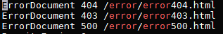

##### Redirección HTTP a HTTPS
```bash
# Primero habilitamos el modulo rewrite
sudo a2enmod rewrite
#Luego vamos al .htacces de nuestra pagina, se encuentra en /var/www/html y ponemos lo siguiente
RewriteEngine On 
RewriteCond %{SERVER_PORT} 80 
RewriteRule ^(.*)$ https://www.dominio.com/$1 [R,L]
```
Quedará algo así\
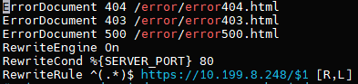\
Explicación de las directivas de .httaccess
- **Options +FollowSymLinks** - es una directiva de Apache, requisito previo para mod_rewrite. 
- **RewriteEngine On** - habilita mod_rewrite. 
- **RewriteCond  %{SERVER_PORT}  80** - sirve para indicar que todas las peticiones que se realicen al puerto 80 (puerto por defecto de Apache para servicio web), deseamos que vayan a través de la regla especificada. 
- **RewriteRule** - define una regla particular. 
Dentro de la regla de reescritura, la primera cadena de caracteres después de RewriteRule, define lo que la URL original parece. 
La segunda cadena después de RewriteRule define la nueva URL. 

  - **$1** - Este carácter especial, sustituye (o indica) la parte entre paréntesis, especificada en la primera cadena. Básicamente, lo que haces es asegurar que las sub-páginas redireccionan a la misma sub-página y no a la página principal. Puede omitirlo para redirigir a la página principal. (Si usted no tiene el mismo contenido en el nuevo directorio que había en el antiguo directorio, deje esta expresión regular 

  - **[R,L]**- Esta opción, realiza una redirección, y también deshabilita que las reglas de reescritura que estén escritas después afecten a la dirección URL (una buena idea para añadir después de la última rewrite rule).
##### Enjaular Usuarios
```bash
# Crear el grupo para meter a los usuarios enjaulados
sudo groupadd sftpusers
# Creación del usuario y cambio de contraseña
sudo useradd -g www-data -G sftpusers -m -d /var/www/nombredeusuario nombredeusuario

sudo passwd nombredeusuario
# El propietario del directorio jaula y los directorios sobre este, debe ser root. 
# El home del usuario pertenece al root 
sudo chown root:root /var/www/nombredeusuario
# Eliminar el permiso de escritura 
sudo chmod 555 /var/www/nombredeusuario
```
Por lo tanto, el usuario no tendría privilegios de escritura sobre su directorio. Para evitar ese problema se crea un directorio ‘ httpdocs ’, dentro de la jaula, que sea de propiedad y es allí donde él pueda escribir como leer archivos.
```bash
# Creacion de la carpeta httpdocs
sudo mkdir /var/www/nombredeusuario/httpdocs
# Permisos de httpdocs
sudo chmod2775 –R /var/www/nombredeusuario/httpdocs
# Propietarios de httpdocs
sudo chown nombredeusuario:www-data –R /var/www/nombredeusuario/httpdocs
```
Editar /etc/ssh/sshd_config
```bash 
# Subsystem sftp /usr/lib/openssh
Subsystem sftp internal
Match Group sftpusers 
ChrootDirectory %h
ForceCommand internal-sftp -u 2 
AllowTcpForwarding yes 
PermitTunnel no 
X11Forwarding no
```
#### 1.1.7 DNS
#### 1.1.8 SFTP
#### 1.1.9 Apache Tomcat
#### 1.1.10 LDAP

#### 1.2.2 **Navegadores**
#### 1.2.3 **MobaXTerm**

#### 1.2.4 **Netbeans**
##### **Crear Proyecto**
1. En nuestro almacenamiento local, es decir, la maquina anfitriona (en mi caso Windows 10) creamos una carpeta para guardar nuestro proyecto\
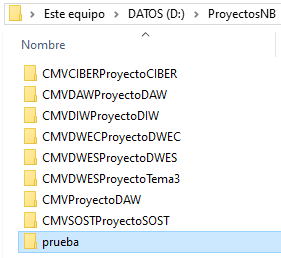
2. En nuestro almacenamiento remoto, es decir, nuestro servidor web en una máquina virtual de Ubuntu Server version 24.04.3 crearemos tambien un directorio en /var/www/html con el nombre del proyecto y dentro un index\
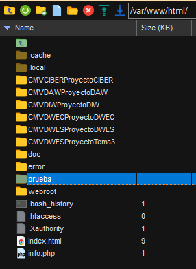\
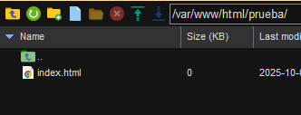
3. Ahora en Netbeans creamos el proyecto eligiendo el almacenamiento remoto de donde cogerá los archivos para empezar (el directorio con el index que creamos antes)
   1. Arriba a la izquierda damos a crear proyecto y luego elegimos PHP y la tercera opción\
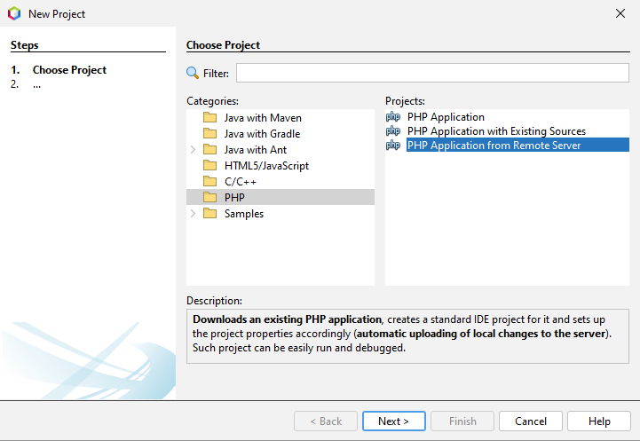
   2. Ahora pondremos el nombre del proyecto y su ubicacion (la carpeta local de antes)\
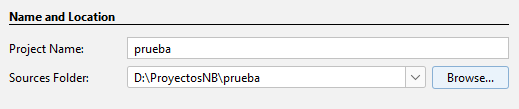
   3. Ahora ponemos la url del servidor y el directorio de donde se cargaran los archivos (el index de antes)\
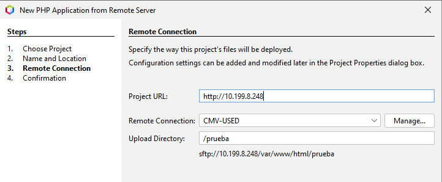
   4. Despues de dar varias veces a siguiente ya nos aparecerá el proyecto creado a la izquierda y tendremos el index creado en el servidor accesible desde el IDE\
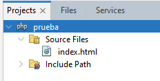

##### **Eliminar Proyecto**
1. Para eliminar un proyecto haremos clic derecho sobre el proyecto que queremos eliminar y ahí le daremos a "Delete".\
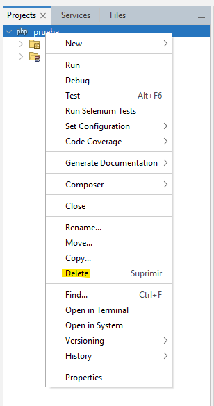
2. Se nos abrirá una ventana de confirmación que tendrá una opción para marcar por si queremos eliminar tambien la carpeta y los archivos del proyecto,elegimos esa opcion si queremos.\
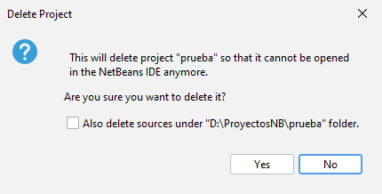
1. Ahora en nuestro almacenamiento local, donde creamos el proyecto, ya no nos aparecerá, ya que se ha eliminado.
2. Pero aún conservaremos la carpeta y los archivos en remoto, los cuales si queremos podemos reutilizar para volver a crear un proyecto con ellos, o eliminarlos tambien.

##### **Control de versiones**
1. Abrimos nuestro proyecto en Netbeans.
2. Hacemos click derecho en el proyecto y en el apartado "Versioning" le damos a inicializar repositorio.\

3. Hacer commit.\
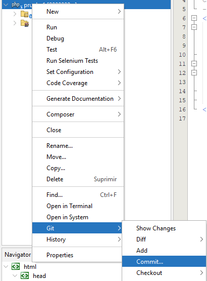
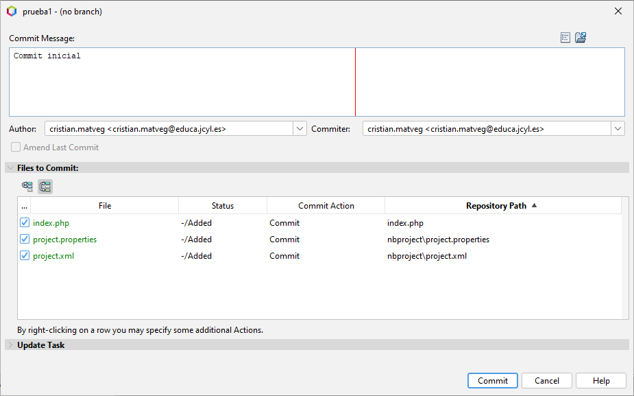
4. Ahora estaremos en la rama master, para crear y cambiar ramas.\
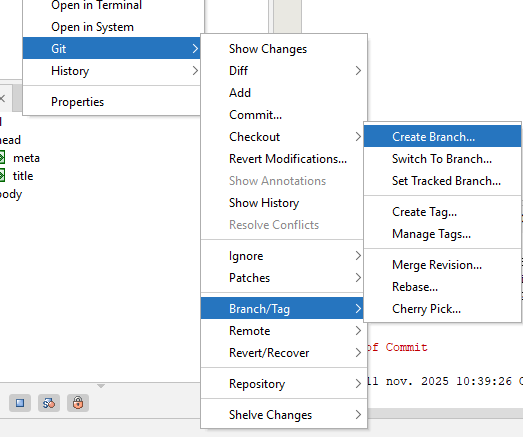
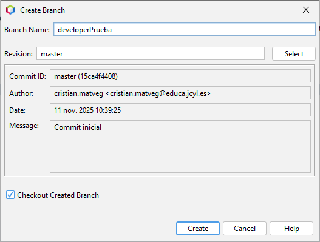
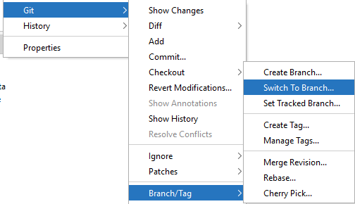
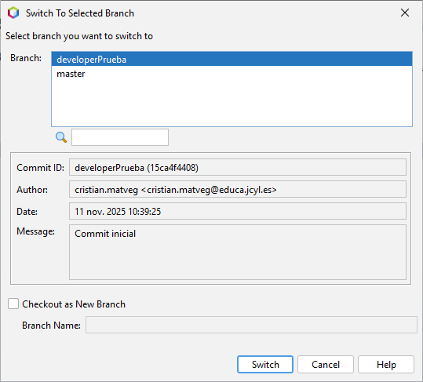
5. Clonar repositorio.\
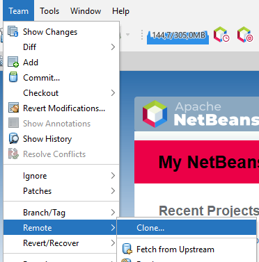
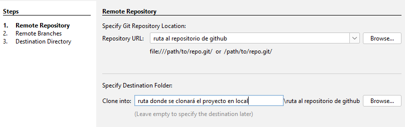
Luego se eligen las ramas para clonar y se le pone un nombre al nuevo proyecto clonado.
6. Hacer Push y Pull.\

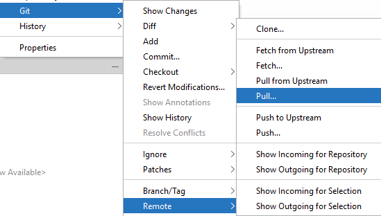
Tanto para Pull como para Push la ventana que se abrirá será la misma, primero se elige la ruta del repositorio al que se va a subir o se va a descargar el contenido, luego las ramas remotas en las que está ese contenido y por ultimo, en el case de push las ramas locales de donde sale el contenido.
##### **Debug**
##### **Conexión con bases de datos**
1. Ir a la pestaña services y hacer click derecho en Database > New Connection...\
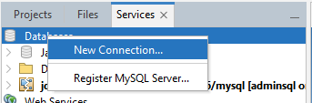
2. Elegir driver\

3. Configurar los datos de la base de datos como el usuario, el host...\
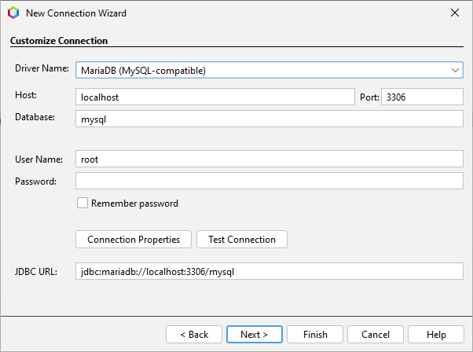

#### 1.2.5 **Visual Studio Code**
---

> **Cristian Mateos Vega**  
> Curso: 2025/2026  
> 2º Curso CFGS Desarrollo de Aplicaciones Web  

